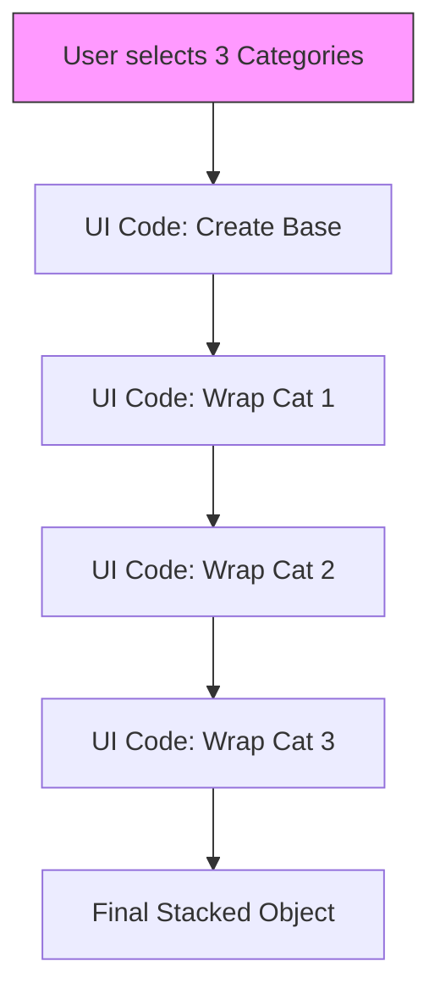
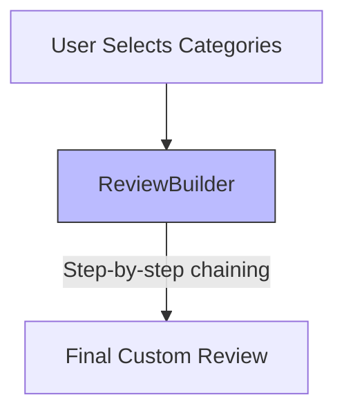
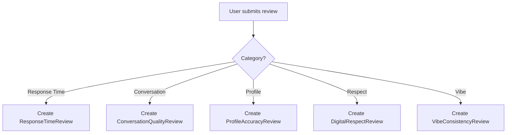
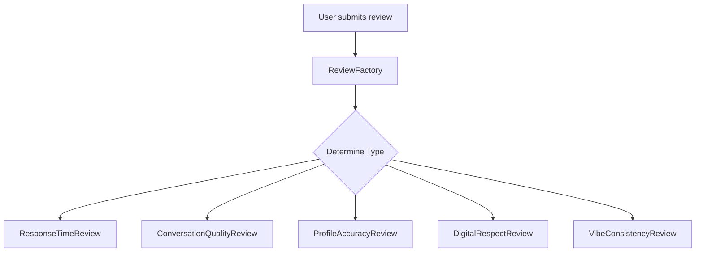
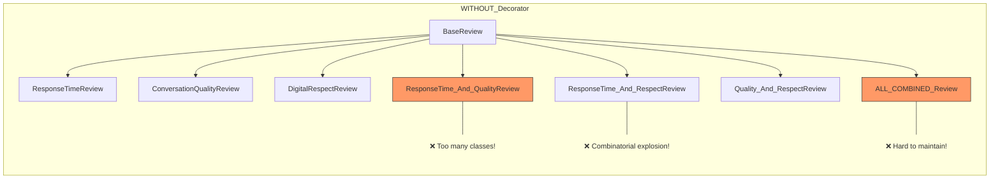
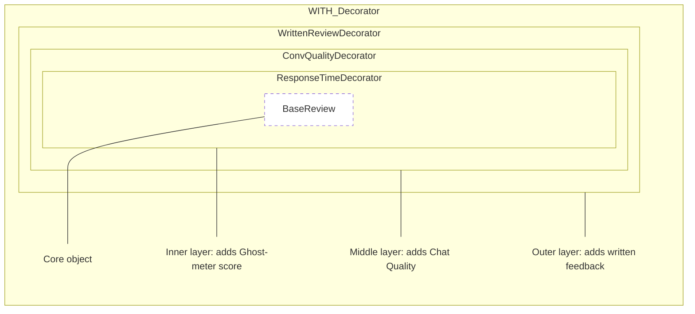

# Dateboxd: A UPV Dating App

## App Summary
**Dateboxd** is a dating app tailored for UPV students. While most dating app only allows the users to get to know their match through profile summaries and chats, Dateboxd allows you to check your match's vibe score from their previous matches. 

Before you even decide to meet at the lover's lane or commute to the city campus, you can check a match’s **Vibe Score**. This score is built from peer reviews of their **online-only interactions**. It’s basically a community-led "Vibe Check" to ensure you’re not wasting your time on low-effort matches, ghosters, or "catfishes."

### The Twist
This dating app is inspired by letterboxd, where instead of a movie, you can rate and review your previous matches. 
After you and your match chatted for a certain period, you can choose to vibe check or rate your match based on different optional categories, or you can leave a review about your experience with your match.

### The 5 Digital Vibe Categories:
1.  **Response Time (Ghost-Meter):** Does it take them 3-5 business days to reply, or is the energy consistent?
2.  **Quality of Conversation:** Is it just "kamusta?" and "hi," or do they actually know how to carry a conversation?
3.  **Profile Accuracy:** Does their digital persona match their actual vibe (and program/acad org)?
4.  **Digital Respect:** Do they stay respectful in the DMs, or are they sending unsolicited vibes?
5.  **Vibe Consistency:** Is the energy they give off in their bio the same energy you get in the chat?

### Leaving a Review
Other than rating them based on the given categories, users can also leave a review or anything they wanted other users to know about their match.

## Design Pattern Implementation

### 1. Creational Design Pattern
* **Name of Pattern:** Creational - Builder
* **Concept in Conyo:**

 So, the real twist here is that since the 5 categories are optional and users can choose any combination—like maybe Response Time and Digital Respect lang, or everything plus a review—we use the Builder Pattern to handle that custom "stacking" logic.

Instead of the UI code being haggard and manually wrapping decorators every time a user clicks a checkbox, we use a ReviewBuilder. The Builder acts like a "Personal Assistant" where you just say, "Hoy, add Response Time" and "Hoy, add Respect," and then you hit .build() to get the final object.

Parang sa Subway lang or Make-Your-Own-Halo-Halo station in the city campus. You don't just order a "Standard Review"; you tell the staff, "add pearls," "add leche flan," and "add ube." The Builder follows your specific order step-by-step until the masterpiece is finished.v
* **Visual Diagram:**

#### Without Builder


#### With Builder


* **Why it Works Nga:**

 Without the Builder, your UI code would be filled with messy, nested constructor calls like new Respect(new Response(new Base())). Sobrang nakakahilo and prone to bugs if you miss a parenthesis or wrap them in the wrong order.

Advantages of the Builder for Dateboxd:

Fluent Interface: It allows for "chaining" methods, making the code look super clean and readable.

Encapsulation: The UI doesn't need to know how to wrap the Decorators; it only needs to call the simple .add...() methods.

Flexibility: It perfectly handles the "pick-and-choose" nature of our app. Whether a user picks one category or all five, the Builder handles the assembly logic in one place.
* **Pseudocode:**
```
# The Builder handles the step-by-step stacking of Decorators
CLASS ReviewBuilder:
    PRIVATE vibe_object: VibeComponent

    CONSTRUCTOR(match_id):
        # Step 1: Start with the mandatory Base foundation
        self.vibe_object = NEW BaseReview(match_id)

    # Methods for adding specific "layers" (Decorators)
    METHOD add_response_time(score):
        self.vibe_object = NEW ResponseTimeDecorator(self.vibe_object, score)
        RETURN self # Allows for chaining!

    METHOD add_conv_quality(score):
        self.vibe_object = NEW ConvQualityDecorator(self.vibe_object, score)
        RETURN self

    METHOD add_profile_accuracy(score):
        self.vibe_object = NEW ProfileAccuracyDecorator(self.vibe_object, score)
        RETURN self

    METHOD add_digital_respect(score):
        self.vibe_object = NEW DigitalRespectDecorator(self.vibe_object, score)
        RETURN self

    METHOD add_vibe_consistency(score):
        self.vibe_object = NEW VibeConsistencyDecorator(self.vibe_object, score)
        RETURN self

    METHOD add_written_review(text):
        self.vibe_object = NEW WrittenReviewDecorator(self.vibe_object, text)
        RETURN self

    # Step 3: Deliver the final assembled object
    METHOD build():
        RETURN self.vibe_object

# --- IMPLEMENTATION EXAMPLE ---
# How it looks in the Dateboxd App logic:
builder = NEW ReviewBuilder("UPV_Match_2026")

# The UI simply chains the methods based on checkboxes clicked by the student
my_vibe_check = builder.add_response_time(5) \
                       .add_digital_respect(4) \
                       .add_written_review("Super green flag energy!") \
                       .build()

PRINT my_vibe_check.get_vibe_summary()
```

### 2. Behavioral Design Pattern
* **Name of Pattern:** Behavioral - Strategy
* **Concept in Conyo:**

  Kasi sa Dateboxd, hindi lang isa way para i-compute ang Vibe Score ng users. Depende sa need ng app, puwedeng iba-iba ang method ng pagcalculate ng ratings. For example, puwedeng pantay-pantay ang weight ng all categories, puwede rin mas mabigat ang Digital Respect kaysa Response Time, or puwede rin mas mataas ang influence ng recent reviews kaysa old ones. Instead na gumawa tayo ng super daming if-else statements like if standard mode, if weighted mode, if trending mode, ginagamit natin si Strategy Pattern. Gumagawa lang tayo ng iba’t ibang scoring algorithms as separate classes, then puwede silang palitan anytime during runtime. Parang same goal, different diskarte lang siya. Goal = compute Vibe Score, diskarte = chosen strategy. Super flexible nito kasi madaling magpalit o magdagdag ng bagong scoring method without changing the main code.
  
* **Visual Diagram:**

#### Without Factory


#### With Factory


  
* **Why it Works Nga:**

  Without Strategy Pattern, lahat ng score computation logic magiging halo-halo sa isang malaking class. Kapag may bagong scoring system, edit ka nanaman ng core code, which can create bugs and stress.
With Strategy Pattern, bawat algorithm hiwalay ang responsibility. Ang BasicAverageStrategy focus lang sa pagkuha ng average score. Ang WeightedTrustStrategy focus sa pagbibigay higher weight sa trusted or verified reviews. Ang RecentBoostStrategy focus sa pagprioritize ng recent interactions. This follows the Open/Closed Principle kasi open for extension siya (add new strategies), but closed for modification (di gagalawin old code). Perfect ito for apps like Dateboxd na pwedeng mag evolve ang rating logic over time. Mas organized ang code, mas scalable ang system, at less iyak sa debugging.

  
* **Pseudocode:**
  
  ```
  # 1. THE STRATEGY INTERFACE
  # Defines a common interface for all vibe-calculation algorithms.
  INTERFACE ScoringStrategy:
      METHOD calculate(reviewss):
          // Every strategy must implement this logic


  # 2. CONCRETE STRATEGIES
  # Different algorithms for different needs.

  # Concrete Strategy 1
  CLASS BasicAverageStrategy IMPLEMENTS ScoreStrategy:
      FUNCTION calculate(reviews):
          RETURN average of all review scores

  # Concrete Strategy 2
  CLASS WeightedTrustStrategy IMPLEMENTS ScoreStrategy:
      FUNCTION calculate(reviews):
          total = 0
          weightSum = 0

          FOR each review IN reviews:
              weight = review.trust_level
              total += review.score * weight
              weightSum += weight

          RETURN total / weightSum

  # Concrete Strategy 3
  CLASS RecentBoostStrategy IMPLEMENTS ScoreStrategy:
      FUNCTION calculate(reviews):
          total = 0
          weightSum = 0

          FOR each review IN reviews:
              IF review.is_recent:
                  weight = 2
              ELSE:
                  weight = 1

              total += review.score * weight
              weightSum += weight

          RETURN total / weightSum

  # 3. THE CONTEXT
  # This is the class the App UI interacts with. 
  # It doesn't know HOW the score is calculated, only that it IS calculated.
  CLASS VibeCalculatorContext:
      PRIVATE strategy: ScoringStrategy

      # Allows the app to change scoring logic on the fly
      METHOD set_strategy(new_strategy):
          self.strategy = new_strategy

      METHOD get_score(user_data):
          RETURN self.strategy.calculate(user_data)

  # 4. IMPLEMENTATION EXAMPLE
  # Client-side usage in the Dateboxd App
  calculator = NEW VibeCalculatorContext()

  # User wants a standard vibe check
  calculator.set_strategy(NEW BasicAverageStrategy())
  PRINT "Standard Score: " + calculator.get_score(match_ratings)

  # Admin wants to flag "red flag" behavior by prioritizing Respect scores
  calculator.set_strategy(NEW SafetyFirstStrategy())
  PRINT "Safety-Adjusted Score: " + calculator.get_score(match_ratings)

  ```
  
### 3. Structural Design Pattern
* **Name of Pattern:** Structural - Decorator
* **Concept in Conyo:**

  Kasi nga optional only ang categorical ratings in Dateboxd, it is bagay talaga to make gamit Decorator Pattern to implement our feature. We start with the Base Review and wrap it layer by layer gamit ang decorators. It's like similar to making halo-halo where you can make pili the toppings you want to add. Like, you can make lagay sago if you want it in your halo halo or you not make lagay beans if it you don't like it. So in our Dateboxd, the user can just pili if gusto nila irate ang quality conversation, we can just make wrap our base review with qualityConversationDecorator. If they want to leave a review, the program will just wrap it with a review decorator. They are not made pilit to rate all categories or to bigay a review.
  

The base review ay foundation lang siya, and we just make wrap it with a specific decorator that the user wanted to implement.
* **Visual Diagram:**

#### Without Decorator

#### With Decorator


* **Why it Works Nga:**

  Without our pinakamamahal na decorator, we need to make iba't ibang classes for the categories pati narin ang kanilang combinations na magmemake result on class explosion which is so hirap talaga to maintain sa isang dating app. Yung ating decorator makes our system to be very flexible talaga kasi we only need to wrap our base review to make dagdag the categories na want ng users irate, or if gusto nila magbigay ng review. This also adheres to the isa sa SOLID principles, yung Single Responsibility Principle kung saan each decorator only make focus sa kaniyang implementation, like yung profileAccuracyDecorator only make focus sa pagmanage ng pag-implement ng profile accuracy category, and so on, like gets ba? This will also make our buhay easier kung may idadagdag tayo na categories or ways to vibe check our matches like if magdagdag tayo ng tags na functionality other than the categories or reviews.
* **Pseudocode:**
```
# 1. THE BASE INTERFACE
# This defines the "contract" that all reviews and decorators must follow.
CLASS VibeComponent:
    FUNCTION get_vibe_summary():
        // Returns the string description of the vibe check
    FUNCTION get_total_score():
        // Returns the accumulated numeric rating

# 2. THE CONCRETE COMPONENT (The Foundation)
# The bare minimum review object before any categories are added.
CLASS BaseReview IMPLEMENTS VibeComponent:
    CONSTRUCTOR(match_id):
        self.match_id = match_id
        self.base_score = 0 // Base review starts with no score

    FUNCTION get_vibe_summary():
        RETURN "Vibe check for " + self.match_id

    FUNCTION get_total_score():
        RETURN self.base_score

# 3. THE BASE DECORATOR
# The wrapper that delegates calls to the wrapped object.
CLASS ReviewDecorator IMPLEMENTS VibeComponent:
    CONSTRUCTOR(wrapped_vibe):
        self.wrapped_vibe = wrapped_vibe

    FUNCTION get_vibe_summary():
        RETURN self.wrapped_vibe.get_vibe_summary()

    FUNCTION get_total_score():
        RETURN self.wrapped_vibe.get_total_score()

# 4. SPECIFIC CATEGORY DECORATORS (The Layers)

# Category 1: Response Time (Ghost-Meter)
CLASS ResponseTimeDecorator EXTENDS ReviewDecorator:
    CONSTRUCTOR(wrapped_vibe, score):
        SUPER(wrapped_vibe)
        self.score = score

    FUNCTION get_vibe_summary():
        RETURN self.wrapped_vibe.get_vibe_summary() + " | Response: " + self.score + "/5"

    FUNCTION get_total_score():
        RETURN self.wrapped_vibe.get_total_score() + self.score

# Category 2: Quality of Conversation
CLASS ConvQualityDecorator EXTENDS ReviewDecorator:
    CONSTRUCTOR(wrapped_vibe, score):
        SUPER(wrapped_vibe)
        self.score = score

    FUNCTION get_vibe_summary():
        RETURN self.wrapped_vibe.get_vibe_summary() + " | Chat Quality: " + self.score + "/5"

    FUNCTION get_total_score():
        RETURN self.wrapped_vibe.get_total_score() + self.score

# Category 3: Profile Accuracy
CLASS ProfileAccuracyDecorator EXTENDS ReviewDecorator:
    CONSTRUCTOR(wrapped_vibe, score):
        SUPER(wrapped_vibe)
        self.score = score

    FUNCTION get_vibe_summary():
        RETURN self.wrapped_vibe.get_vibe_summary() + " | Accuracy: " + self.score + "/5"

    FUNCTION get_total_score():
        RETURN self.wrapped_vibe.get_total_score() + self.score

# Category 4: Digital Respect
CLASS DigitalRespectDecorator EXTENDS ReviewDecorator:
    CONSTRUCTOR(wrapped_vibe, score):
        SUPER(wrapped_vibe)
        self.score = score

    FUNCTION get_vibe_summary():
        RETURN self.wrapped_vibe.get_vibe_summary() + " | Respect: " + self.score + "/5"

    FUNCTION get_total_score():
        RETURN self.wrapped_vibe.get_total_score() + self.score

# Category 5: Vibe Consistency
CLASS VibeConsistencyDecorator EXTENDS ReviewDecorator:
    CONSTRUCTOR(wrapped_vibe, score):
        SUPER(wrapped_vibe)
        self.score = score

    FUNCTION get_vibe_summary():
        RETURN self.wrapped_vibe.get_vibe_summary() + " | Consistency: " + self.score + "/5"

    FUNCTION get_total_score():
        RETURN self.wrapped_vibe.get_total_score() + self.score

# Extra Feature: Letterboxd-style Written Review
CLASS WrittenReviewDecorator EXTENDS ReviewDecorator:
    CONSTRUCTOR(wrapped_vibe, review_text):
        SUPER(wrapped_vibe)
        self.review_text = review_text

    FUNCTION get_vibe_summary():
        // Stacks the text at the end of the summary
        RETURN self.wrapped_vibe.get_vibe_summary() + " [Review: " + self.review_text + "]"

    FUNCTION get_total_score():
        // Written reviews don't add to the numeric score
        RETURN self.wrapped_vibe.get_total_score()

# 5. USAGE
// 1. Start with the base
vibe_check = BaseReview("UPV_Match_2026")

// 2. Wrap only the categories the user chose
IF user_rated_response:
    vibe_check = ResponseTimeDecorator(vibe_check, 5)

IF user_rated_respect:
    vibe_check = DigitalRespectDecorator(vibe_check, 4)

IF user_left_comment:
    vibe_check = WrittenReviewDecorator(vibe_check, "Super green flag!")

// 3. Output the final stacked result
PRINT vibe_check.get_vibe_summary()
PRINT "Total Score: " + vibe_check.get_total_score()
```


